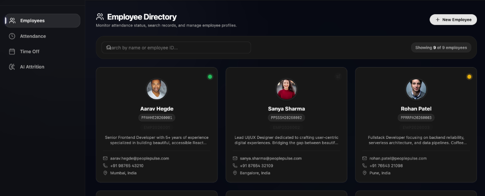
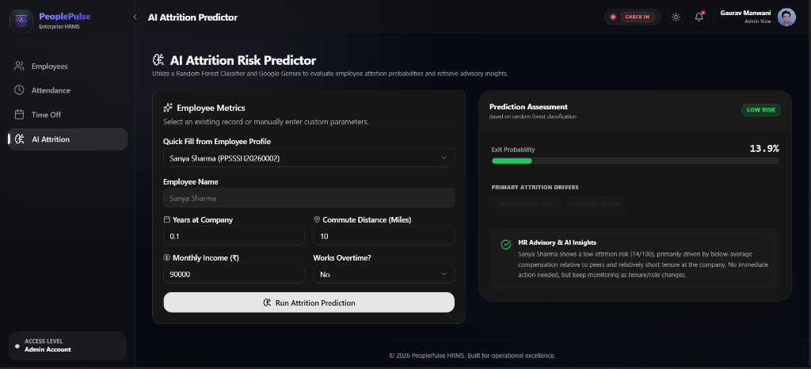
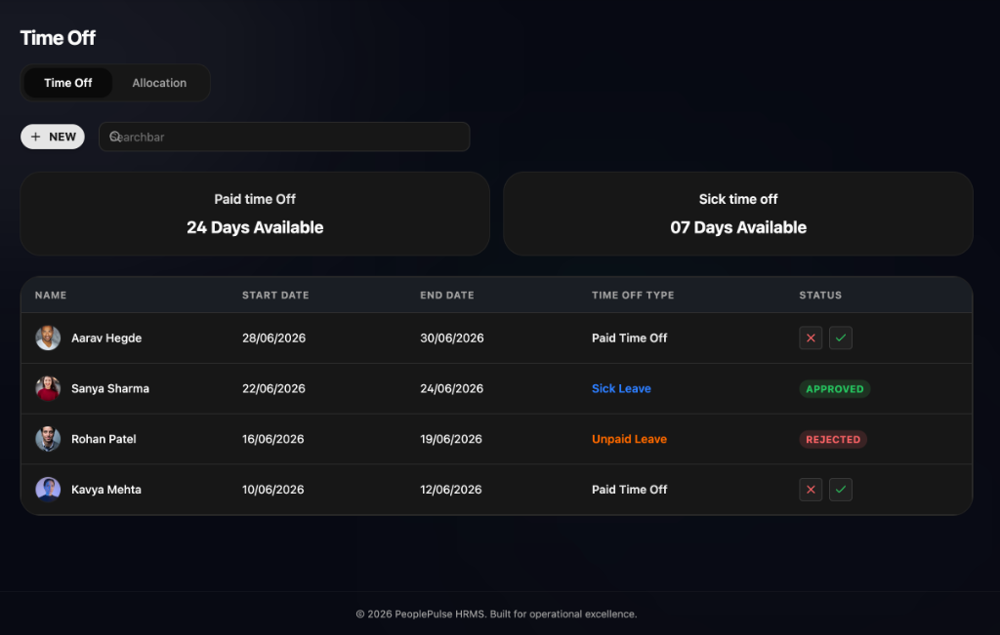
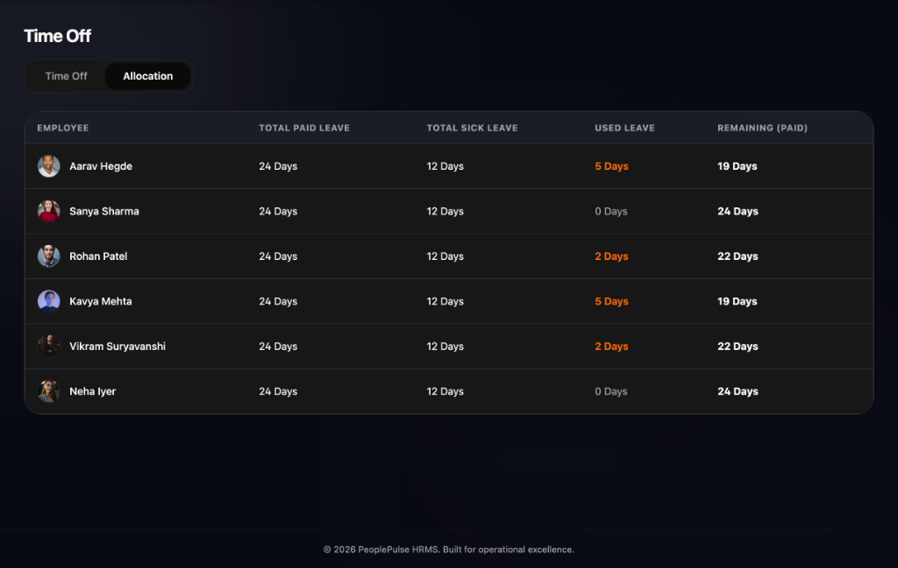

# 🌟 PeoplePulse - Premium HR Management System

PeoplePulse is a state-of-the-art, feature-rich Human Resource Management System (HRMS). It features beautiful modern aesthetics (neon-glowing double-layered cards, custom animations, glassmorphic UI widgets), localized browser database caching, and integrated AI capabilities to predict employee attrition risk.

---

## 📸 Screenshots Gallery

### Employee Directory Dashboard


### AI Attrition Risk Predictor


### Time Off Management & Requests


### Time Off Allocations


---

## 📂 Project Repository Structure

The project is structured into three self-contained modules:

| Component | Technology Stack | Description | Location |
| :--- | :--- | :--- | :--- |
| **Frontend** | React, Vite, Tailwind CSS, Framer Motion, Base UI | High-fidelity SPA UI utilizing local storage as its main database. | `/hrms - FRONTEND` |
| **Backend** | Spring Boot, JPA/Hibernate, Gradle | Enterprise Java backend handling company registrations and auth logic. | `/hrms-BACKEND` |
| **AI Service** | FastAPI, Scikit-Learn (Random Forest), Google Gemini API | Machine Learning microservice computing exit risks & HR advisories. | `/ai-service` |

---

## 🚀 Setup & Execution Instructions

Follow the steps below to set up and boot all three services locally:

### 1. Frontend Setup (`/hrms - FRONTEND`)
1. Navigate into the frontend workspace:
   ```bash
   cd "hrms - FRONTEND"
   ```
2. Install pinned dependencies:
   ```bash
   npm install
   ```
3. Boot up the Vite local dev server:
   ```bash
   npm run dev
   ```
   *The client interface will boot up locally at `http://localhost:5173` (or the fallback indicated in the CLI).*

### 2. Backend Service Setup (`/hrms-BACKEND`)
1. Navigate into the backend repository:
   ```bash
   cd hrms-BACKEND
   ```
2. Build and boot the Spring Boot application:
   ```bash
   ./gradlew bootRun
   ```
   *The server will run on port `8082` (`http://localhost:8082`).*

### 3. AI Service Setup (`/ai-service`)
1. Navigate into the AI microservice folder:
   ```bash
   cd ai-service
   ```
2. Install Python dependencies:
   ```bash
   pip install -r requirements.txt
   ```
3. Copy environment configuration:
   ```bash
   cp .env.example .env
   ```
   *(Add your `GEMINI_API_KEY` inside `.env` to enable Gemini AI qualitative recommendations).*
4. Train the Machine Learning model binary (must be run once before starting the server):
   ```bash
   python model/train_model.py
   ```
5. Run the FastAPI ASGI server:
   ```bash
   uvicorn app.main:app --reload --port 8000
   ```
   *The microservice API listens at `http://localhost:8000`.*

---

## ✨ Core Features & Implementation Details

### 🔑 Localized Authentication & Database
* **Local Storage Main Database**: Uses browser local storage (`pp_employees` and `pp_user`) as the core database store for high-performance offline presentation.
* **No Default Logged-In State**: Authentic sessions resolve to `null` initially (requiring explicit logins) rather than defaulting to active mock admin profiles.

### 🛡️ Admin & Role-Based Permissions
* **Salary Adjustments**: Administrators can customize salary brackets, Professional Tax, Provident Fund rates, and Daily Break durations for **any** employee by visiting their profile's *Salary Info* tab.
* **Route Constraints**: The **AI Attrition** metrics portal is protected by a route guard redirecting non-admin users to the landing page and hiding the sidebar navigation tab entirely.

### 📋 Custom Odoo India (OI) Onboarding Format
* **OI Login ID Generation**: Newly created employee IDs are generated using the formula:
  * `OI` (Odoo India Prefix) + `[First 2 characters of First Name + Last Name]` + `[Year of Joining]` + `[4-digit Joining Serial]`.
  * *Example: `OIJODO20220001` (John Doe joining in 2022).*
* **Temporary Credentials Popup**: Creates a random temporary password for the newly onboarded user, showing it in a custom popup modal with a single-click **Copy Credentials** clipboard option.

### ⏱️ Real-Time Attendance Calendar
* **Session Tracking**: Calculates check-in and checkout durations dynamically, logs total hours worked, and computes overtime.
* **Active Status Rendering**: Displays currently checked-in employees as `"Active"` in real time in both individual history logs and administrator control boards.